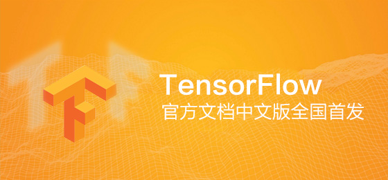
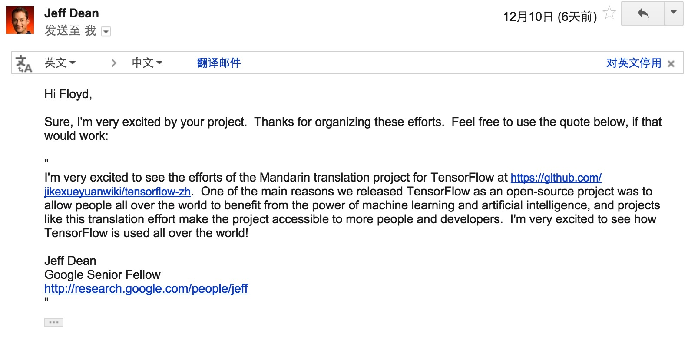

# TensorFlow 官方文档中文版

   

### 你正在阅读的项目可能会比 Android 系统更加深远地影响着世界！   

## 缘起 

2015年11月9日，Google发布人工智能系统TensorFlow并宣布开源，同日，极客学院组织在线TensorFlow中文文档翻译。

机器学习作为人工智能的一种类型，可以让软件根据大量的数据来对未来的情况进行阐述或预判。如今，领先的科技巨头无不在机器学习下予以极大投入。Facebook、苹果、微软，甚至国内的百度。Google 自然也在其中。「TensorFlow」是 Google 多年以来内部的机器学习系统。如今，Google 正在将此系统成为开源系统，并将此系统的参数公布给业界工程师、学者和拥有大量编程能力的技术人员，这意味着什么呢？

打个不太恰当的比喻，如今 Google 对待 TensorFlow 系统，有点类似于该公司对待旗下移动操作系统 Android。如果更多的数据科学家开始使用 Google 的系统来从事机器学习方面的研究，那么这将有利于 Google 对日益发展的机器学习行业拥有更多的主导权。

为了让国内的技术人员在最短的时间内迅速掌握这一世界领先的 AI 系统，极客学院 Wiki 团队发起对 TensorFlow 官方文档的中文协同翻译，一周之内，全部翻译认领完成，一个月后，全部30章节翻译校对完成，上线极客学院Wiki平台并提供下载。

Google TensorFlow项目负责人Jeff Dean为该中文翻译项目回信称："*看到能够将TensorFlow翻译成中文我非常激动，我们将TensorFlow开源的主要原因之一是为了让全世界的人们能够从机器学习与人工智能中获益，类似这样的协作翻译能够让更多的人更容易地接触到TensorFlow项目，很期待接下来该项目在全球范围内的应用!*"  

Jeff回信原文：

再次衷心感谢每一位为该翻译项目做出贡献的同学，我们会持续关注TensorFlow、AI领域以及其它最新技术的发展、持续维护该协作翻译、持续提供更多更优质的内容，为广大IT学习者们服务！

## 内容来源

英文官方网站：     
<http://tensorflow.org/>

官方GitHub仓库：   
<https://github.com/tensorflow/tensorflow>

中文版 GitHub 仓库：  
<https://github.com/jikexueyuanwiki/tensorflow-zh>

## 参与者（按认领章节排序）

### 翻译   

- [@PFZheng](https://github.com/PFZheng)      
- [@Tony Jin](https://github.com/linbojin) 
- [@chenweican](https://github.com/chenweican)
- [@bingjin](https://github.com/bingjin)
- [@oskycar](https://github.com/oskycar)
- [@btpeter](https://github.com/btpeter)
- [@Warln](https://github.com/Warln)
- [@ericxk](https://github.com/ericxk)
- [@wangaicc](https://github.com/wangaicc)
- [@Terence Cooper](https://github.com/TerenceCooper)
- [@zhyhooo](https://github.com/zhyhooo)
- [@thylaco1eo](https://github.com/thylaco1eo)
- [@volvet](https://github.com/volvet)
- [@zhangkom](https://github.com/zhangkom)
- [@derekshang](https://github.com/derekshang)
- [@lianghyv](https://github.com/lianghyv)
- [@nb312](https://github.com/nb312)
- [@Jim-Zenn](https://github.com/Jim-Zenn)
- [@andyiac](https://github.com/andyiac)
- [@Terence Cooper](https://github.com/TerenceCooper)
- [@leege100](https://github.com/leege100)

### 校对

- [@yangtze](https://github.com/sstruct)
- [@ericxk](https://github.com/ericxk)
- [@HongyangWang](https://github.com/WangHong-yang)
- [@LichAmnesia](https://github.com/LichAmnesia)
- [@zhyhooo](https://github.com/zhyhooo)
- [@waiwaizheng](https://github.com/waiwaizheng)
- [@HongyangWang](https://github.com/WangHong-yang)
- [@tensorfly](https://github.com/tensorfly)
- [@lonlonago](https://github.com/lonlonago)
- [@jishaoming](https://github.com/jishaoming)
- [@lucky521](https://github.com/lucky521)
- [@allensummer](http://github.com/allensummer)
- [@volvet](https://github.com/volvet)
- [@ZHNathanielLee](https://github.com/ZHNathanielLee)
- [@pengfoo](https://github.com/PengFoo)
- [@qiaohaijun](https://github.com/qiaohaijun)
- [@Seika](https://github.com/SeikaScarlet)

## 进度记录

- 2015-11-10, 谷歌发布全新人工智能系统TensorFlow并宣布开源, 极客学院Wiki启动协同翻译，创建 GitHub 仓库，制定协同规范 
- 2015-11-18, 所有章节认领完毕，翻译完成18章，校对认领7章，Star数361，fork数100，协同翻译QQ群及技术交流群的TF爱好者将近300人，GitHub搜索TensorFlow排名第二
- 2015-12-10, Star数超过500
- 2015-12-15, 项目正式上线

## 花絮

在组织翻译的过程中，有些事情令人印象深刻，记录下来，希望以后来学习文档的同学能够明了到手中这份文档的由来：

- 参加翻译的有学生，也有老师；有专门研究AI/ML的，也有对此感兴趣的；有国内的，也有远在纽约的；有工程技术人员也有博士、专家
- 其中一位，[恩泽](http://www.longmotto.com)同学，为了翻译一篇文档，在前一天没有睡觉的情况下坚持翻完，20个小时没有合眼
- 还有一位老师，刚从讲台上讲完课，就立即给我们的翻译提修改意见
- 很多同学自发的将搭建环境中遇到的问题总结到FAQ里帮助他人
- 为了一个翻译细节，经常是来回几次，和其他人讨论完善

## 持续改进

这样的一个高技术领域的文档，我们在翻译的过程中，难免会有不完善的地方，希望请大家一起帮助我们持续改进文档的翻译质量，帮助更多的人，方法：

- 在GitHub上提Issue或Pull Request，地址为: [https://github.com/jikexueyuanwiki/tensorflow-zh](https://github.com/jikexueyuanwiki/tensorflow-zh)
- 加入我们的QQ群提建议--协同翻译群：248320884，技术交流群：551830261
- 给我们写邮件： wiki@jikexueyuan.com

## 感谢支持

- [极客学院 Wiki](http://wiki.jikexueyuan.com) 提供图文教程托管服务

## 离线版本

目前，离线版本(PDF、ePub)可正常下载、使用

## Tex-PDF 修订版

[Tex-PDF 修订版](tex_pdf) 目前正在编订中，欢迎加入进来一起修订。您可以在此查看[预览版](tex_pdf/tensorflow_manual_cn.pdf)目前最新状态。
