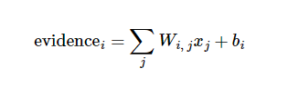
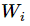
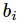
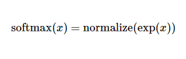
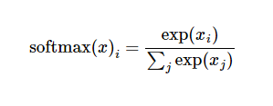
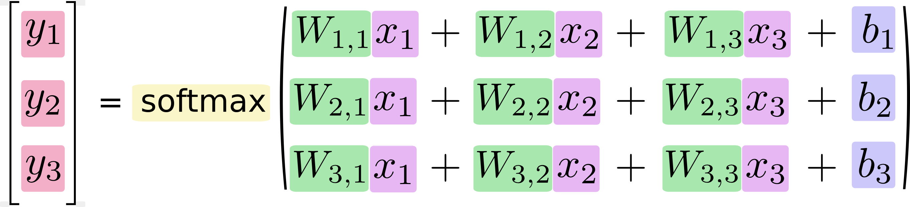
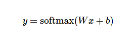
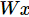
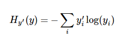
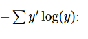

# MNIST机器学习入门 <a class="md-anchor" id="AUTOGENERATED-mnist-for-ml-beginners"></a>

*这个教程的目标读者是对机器学习和TensorFlow都不太了解的新手。如果你已经了解MNIST和softmax回归(softmax regression)的相关知识，你可以阅读这个[快速上手教程](./mnist_pros.md)。*
 
当我们开始学习编程的时候，第一件事往往是学习打印"Hello World"。就好比编程入门有Hello World，机器学习入门有MNIST。

MNIST是一个入门级的计算机视觉数据集，它包含各种手写数字图片：
<div style="width:40%; margin:auto; margin-bottom:10px; margin-top:20px;">

</div>
 
它也包含每一张图片对应的标签，告诉我们这个是数字几。比如，上面这四张图片的标签分别是5，0，4，1。
 
在此教程中，我们将训练一个机器学习模型用于预测图片里面的数字。我们的目的不是要设计一个世界一流的复杂模型 -- 尽管我们会在之后给你源代码去实现一流的预测模型 -- 而是要介绍下如何使用TensorFlow。所以，我们这里会从一个很简单的数学模型开始，它叫做Softmax Regression。

对应这个教程的实现代码很短，而且真正有意思的内容只包含在三行代码里面。但是，去理解包含在这些代码里面的设计思想是非常重要的：TensorFlow工作流程和机器学习的基本概念。因此，这个教程会很详细地介绍这些代码的实现原理。

## MNIST数据集 <a class="md-anchor" id="AUTOGENERATED-the-mnist-data"></a>

MNIST数据集的官网是[Yann LeCun's website](http://yann.lecun.com/exdb/mnist/)。在这里，我们提供了一份python源代码用于自动下载和安装这个数据集。你可以下载[这份代码](https://raw.githubusercontent.com/tensorflow/tensorflow/master/tensorflow/examples/tutorials/mnist/input_data.py)，然后用下面的代码导入到你的项目里面，也可以直接复制粘贴到你的代码文件里面。

```python
import tensorflow.examples.tutorials.mnist.input_data
mnist = input_data.read_data_sets("MNIST_data/", one_hot=True)
```

下载下来的数据集被分成两部分：60000行的训练数据集（`mnist.train`）和10000行的测试数据集（`mnist.test`）。这样的切分很重要，在机器学习模型设计时必须有一个单独的测试数据集不用于训练而是用来评估这个模型的性能，从而更加容易把设计的模型推广到其他数据集上（泛化）。

正如前面提到的一样，每一个MNIST数据单元有两部分组成：一张包含手写数字的图片和一个对应的标签。我们把这些图片设为“xs”，把这些标签设为“ys”。训练数据集和测试数据集都包含xs和ys，比如训练数据集的图片是 `mnist.train.images` ，训练数据集的标签是 `mnist.train.labels`。
 
每一张图片包含28X28个像素点。我们可以用一个数字数组来表示这张图片：

<div style="width:50%; margin:auto; margin-bottom:10px; margin-top:20px;">

</div>

我们把这个数组展开成一个向量，长度是 28x28 = 784。如何展开这个数组（数字间的顺序）不重要，只要保持各个图片采用相同的方式展开。从这个角度来看，MNIST数据集的图片就是在784维向量空间里面的点, 并且拥有比较[复杂的结构](http://colah.github.io/posts/2014-10-Visualizing-MNIST/) (提醒: 此类数据的可视化是计算密集型的)。  

展平图片的数字数组会丢失图片的二维结构信息。这显然是不理想的，最优秀的计算机视觉方法会挖掘并利用这些结构信息，我们会在后续教程中介绍。但是在这个教程中我们忽略这些结构，所介绍的简单数学模型，softmax回归(softmax regression)，不会利用这些结构信息。
  
因此，在MNIST训练数据集中，`mnist.train.images` 是一个形状为 `[60000, 784]` 的张量，第一个维度数字用来索引图片，第二个维度数字用来索引每张图片中的像素点。在此张量里的每一个元素，都表示某张图片里的某个像素的强度值，值介于0和1之间。

<div style="width:40%; margin:auto; margin-bottom:10px; margin-top:20px;">

</div>

相对应的MNIST数据集的标签是介于0到9的数字，用来描述给定图片里表示的数字。为了用于这个教程，我们使标签数据是"one-hot vectors"。 一个one-hot向量除了某一位的数字是1以外其余各维度数字都是0。所以在此教程中，数字n将表示成一个只有在第n维度（从0开始）数字为1的10维向量。比如，标签0将表示成([1,0,0,0,0,0,0,0,0,0,0])。因此， `mnist.train.labels` 是一个 `[60000, 10]` 的数字矩阵。 

<div style="width:40%; margin:auto; margin-bottom:10px; margin-top:20px;">

</div>

现在，我们准备好可以开始构建我们的模型啦！

## Softmax回归介绍 <a class="md-anchor" id="AUTOGENERATED-softmax-regressions"></a>
 
我们知道MNIST的每一张图片都表示一个数字，从0到9。我们希望得到给定图片代表每个数字的概率。比如说，我们的模型可能推测一张包含9的图片代表数字9的概率是80%但是判断它是8的概率是5%（因为8和9都有上半部分的小圆），然后给予它代表其他数字的概率更小的值。

这是一个使用softmax回归（softmax regression）模型的经典案例。softmax模型可以用来给不同的对象分配概率。即使在之后，我们训练更加精细的模型时，最后一步也需要用softmax来分配概率。
 
softmax回归（softmax regression）分两步：第一步
 
为了得到一张给定图片属于某个特定数字类的证据（evidence），我们对图片像素值进行加权求和。如果这个像素具有很强的证据说明这张图片不属于该类，那么相应的权值为负数，相反如果这个像素拥有有利的证据支持这张图片属于这个类，那么权值是正数。

下面的图片显示了一个模型学习到的图片上每个像素对于特定数字类的权值。红色代表负数权值，蓝色代表正数权值。

<div style="width:40%; margin:auto; margin-bottom:10px; margin-top:20px;">

</div>

我们也需要加入一个额外的偏置量（bias），因为输入往往会带有一些无关的干扰量。因此对于给定的输入图片 **x** 它代表的是数字 **i** 的证据可以表示为



其中  代表权重， 代表数字 **i** 类的偏置量，**j** 代表给定图片 **x** 的像素索引用于像素求和。然后用softmax函数可以把这些证据转换成概率 **y**：


这里的softmax可以看成是一个激励（activation）函数或者链接（link）函数，把我们定义的线性函数的输出转换成我们想要的格式，也就是关于10个数字类的概率分布。因此，给定一张图片，它对于每一个数字的吻合度可以被softmax函数转换成为一个概率值。softmax函数可以定义为：



展开等式右边的子式，可以得到：


 
但是更多的时候把softmax模型函数定义为前一种形式：把输入值当成幂指数求值，再正则化这些结果值。这个幂运算表示，更大的证据对应更大的假设模型（hypothesis）里面的乘数权重值。反之，拥有更少的证据意味着在假设模型里面拥有更小的乘数系数。假设模型里的权值不可以是0值或者负值。Softmax然后会正则化这些权重值，使它们的总和等于1，以此构造一个有效的概率分布。（更多的关于Softmax函数的信息，可以参考Michael Nieslen的书里面的这个[部分](http://neuralnetworksanddeeplearning.com/chap3.html#softmax)，其中有关于softmax的可交互式的可视化解释。）

对于softmax回归模型可以用下面的图解释，对于输入的`xs`加权求和，再分别加上一个偏置量，最后再输入到softmax函数中：

<div style="width:55%; margin:auto; margin-bottom:10px; margin-top:20px;">

</div>

如果把它写成一个等式，我们可以得到：

<div style="width:52%; margin-left:25%; margin-bottom:10px; margin-top:20px;">

</div>

我们也可以用向量表示这个计算过程：用矩阵乘法和向量相加。这有助于提高计算效率。（也是一种更有效的思考方式）

<div style="width:50%; margin:auto; margin-bottom:10px; margin-top:20px;">

</div>

更进一步，可以写成更加紧凑的方式：



## 实现回归模型 <a class="md-anchor" id="AUTOGENERATED-implementing-the-regression"></a>

为了用python实现高效的数值计算，我们通常会使用函数库，比如NumPy，会把类似矩阵乘法这样的复杂运算使用其他外部语言实现。不幸的是，从外部计算切换回Python的每一个操作，仍然是一个很大的开销。如果你用GPU来进行外部计算，这样的开销会更大。用分布式的计算方式，也会花费更多的资源用来传输数据。

TensorFlow也把复杂的计算放在python之外完成，但是为了避免前面说的那些开销，它做了进一步完善。Tensorflow不单独地运行单一的复杂计算，而是让我们可以先用图描述一系列可交互的计算操作，然后全部一起在Python之外运行。（这样类似的运行方式，可以在不少的机器学习库中看到。）

使用TensorFlow之前，首先导入它：

```python
import tensorflow as tf
```

我们通过操作符号变量来描述这些可交互的操作单元，可以用下面的方式创建一个：

```python
x = tf.placeholder(tf.float32, [None, 784])
```

`x`不是一个特定的值，而是一个占位符`placeholder`，我们在TensorFlow运行计算时输入这个值。我们希望能够输入任意数量的MNIST图像，每一张图展平成784维的向量。我们用2维的浮点数张量来表示这些图，这个张量的形状是`[None，784 ]`。（这里的`None`表示此张量的第一个维度可以是任何长度的。）

我们的模型也需要权重值和偏置量，当然我们可以把它们当做是另外的输入（使用占位符），但TensorFlow有一个更好的方法来表示它们：`Variable` 。
一个`Variable`代表一个可修改的张量，存在在TensorFlow的用于描述交互性操作的图中。它们可以用于计算输入值，也可以在计算中被修改。对于各种机器学习应用，一般都会有模型参数，可以用`Variable`表示。

```python
W = tf.Variable(tf.zeros([784,10]))
b = tf.Variable(tf.zeros([10]))
```

我们赋予`tf.Variable`不同的初值来创建不同的`Variable`：在这里，我们都用全为零的张量来初始化`W`和`b`。因为我们要学习`W`和`b`的值，它们的初值可以随意设置。

注意，`W`的维度是[784，10]，因为我们想要用784维的图片向量乘以它以得到一个10维的证据值向量，每一位对应不同数字类。`b`的形状是[10]，所以我们可以直接把它加到输出上面。

现在，我们可以实现我们的模型啦。只需要一行代码！

```python
y = tf.nn.softmax(tf.matmul(x,W) + b)
```

首先，我们用`tf.matmul(​​X，W)`表示`x`乘以`W`，对应之前等式里面的，这里`x`是一个2维张量拥有多个输入。然后再加上`b`，把和输入到`tf.nn.softmax`函数里面。

至此，我们先用了几行简短的代码来设置变量，然后只用了一行代码来定义我们的模型。TensorFlow不仅仅可以使softmax回归模型计算变得特别简单，它也用这种非常灵活的方式来描述其他各种数值计算，从机器学习模型对物理学模拟仿真模型。一旦被定义好之后，我们的模型就可以在不同的设备上运行：计算机的CPU，GPU，甚至是手机！

## 训练模型 <a class="md-anchor" id="AUTOGENERATED-training"></a>

为了训练我们的模型，我们首先需要定义一个指标来评估这个模型是好的。其实，在机器学习，我们通常定义指标来表示一个模型是坏的，这个指标称为成本（cost）或损失（loss），然后尽量最小化这个指标。但是，这两种方式是相同的。

一个非常常见的，非常漂亮的成本函数是“交叉熵”（cross-entropy）。交叉熵产生于信息论里面的信息压缩编码技术，但是它后来演变成为从博弈论到机器学习等其他领域里的重要技术手段。它的定义如下：



**y** 是我们预测的概率分布, **y'** 是实际的分布（我们输入的one-hot vector)。比较粗糙的理解是，交叉熵是用来衡量我们的预测用于描述真相的低效性。更详细的关于交叉熵的解释超出本教程的范畴，但是你很有必要好好[理解它](http://colah.github.io/posts/2015-09-Visual-Information/)。

为了计算交叉熵，我们首先需要添加一个新的占位符用于输入正确值：

```python
y_ = tf.placeholder("float", [None,10])
```

然后我们可以用  计算交叉熵:

```python
cross_entropy = -tf.reduce_sum(y_*tf.log(y))
```

首先，用 `tf.log` 计算 `y` 的每个元素的对数。接下来，我们把 `y_` 的每一个元素和 `tf.log(y)` 的对应元素相乘。最后，用 `tf.reduce_sum` 计算张量的所有元素的总和。（注意，这里的交叉熵不仅仅用来衡量单一的一对预测和真实值，而是所有100幅图片的交叉熵的总和。对于100个数据点的预测表现比单一数据点的表现能更好地描述我们的模型的性能。

现在我们知道我们需要我们的模型做什么啦，用TensorFlow来训练它是非常容易的。因为TensorFlow拥有一张描述你各个计算单元的图，它可以自动地使用[反向传播算法(backpropagation algorithm)](http://colah.github.io/posts/2015-08-Backprop/)来有效地确定你的变量是如何影响你想要最小化的那个成本值的。然后，TensorFlow会用你选择的优化算法来不断地修改变量以降低成本。

```python
train_step = tf.train.GradientDescentOptimizer(0.01).minimize(cross_entropy)
```

在这里，我们要求TensorFlow用梯度下降算法（gradient descent algorithm）以0.01的学习速率最小化交叉熵。梯度下降算法（gradient descent algorithm）是一个简单的学习过程，TensorFlow只需将每个变量一点点地往使成本不断降低的方向移动。当然TensorFlow也提供了[其他许多优化算法](../api_docs/python/train.md#optimizers)：只要简单地调整一行代码就可以使用其他的算法。

TensorFlow在这里实际上所做的是，它会在后台给描述你的计算的那张图里面增加一系列新的计算操作单元用于实现反向传播算法和梯度下降算法。然后，它返回给你的只是一个单一的操作，当运行这个操作时，它用梯度下降算法训练你的模型，微调你的变量，不断减少成本。

现在，我们已经设置好了我们的模型。在运行计算之前，我们需要添加一个操作来初始化我们创建的变量：

```python
init = tf.initialize_all_variables()
```

现在我们可以在一个`Session`里面启动我们的模型，并且初始化变量：

```python
sess = tf.Session()
sess.run(init)
```

然后开始训练模型，这里我们让模型循环训练1000次！

```python
for i in range(1000):
  batch_xs, batch_ys = mnist.train.next_batch(100)
  sess.run(train_step, feed_dict={x: batch_xs, y_: batch_ys})
```

该循环的每个步骤中，我们都会随机抓取训练数据中的100个批处理数据点，然后我们用这些数据点作为参数替换之前的占位符来运行`train_step`。 

使用一小部分的随机数据来进行训练被称为随机训练（stochastic training）- 在这里更确切的说是随机梯度下降训练。在理想情况下，我们希望用我们所有的数据来进行每一步的训练，因为这能给我们更好的训练结果，但显然这需要很大的计算开销。所以，每一次训练我们可以使用不同的数据子集，这样做既可以减少计算开销，又可以最大化地学习到数据集的总体特性。

## 评估我们的模型 <a class="md-anchor" id="AUTOGENERATED-evaluating-our-model"></a>

那么我们的模型性能如何呢？

首先让我们找出那些预测正确的标签。`tf.argmax` 是一个非常有用的函数，它能给出某个tensor对象在某一维上的其数据最大值所在的索引值。由于标签向量是由0,1组成，因此最大值1所在的索引位置就是类别标签，比如`tf.argmax(y,1)`返回的是模型对于任一输入x预测到的标签值，而 `tf.argmax(y_,1)` 代表正确的标签，我们可以用 `tf.equal` 来检测我们的预测是否真实标签匹配(索引位置一样表示匹配)。

```python
correct_prediction = tf.equal(tf.argmax(y,1), tf.argmax(y_,1))
```

这行代码会给我们一组布尔值。为了确定正确预测项的比例，我们可以把布尔值转换成浮点数，然后取平均值。例如，`[True, False, True, True]` 会变成 `[1,0,1,1]` ，取平均值后得到 `0.75`.

```python
accuracy = tf.reduce_mean(tf.cast(correct_prediction, "float"))
```

最后，我们计算所学习到的模型在测试数据集上面的正确率。

```python
print sess.run(accuracy, feed_dict={x: mnist.test.images, y_: mnist.test.labels})
```

这个最终结果值应该大约是91%。

这个结果好吗？嗯，并不太好。事实上，这个结果是很差的。这是因为我们仅仅使用了一个非常简单的模型。不过，做一些小小的改进，我们就可以得到97％的正确率。最好的模型甚至可以获得超过99.7％的准确率！（想了解更多信息，可以看看这个关于各种模型的[性能对比列表](http://rodrigob.github.io/are_we_there_yet/build/classification_datasets_results.html)。)

比结果更重要的是，我们从这个模型中学习到的设计思想。不过，如果你仍然对这里的结果有点失望，可以查看[下一个教程](./mnist_pros.md)，在那里你可以学习如何用TensorFlow构建更加复杂的模型以获得更好的性能！

原文地址：[MNIST For ML Beginners](http://tensorflow.org/tutorials/mnist/beginners/index.md) 翻译：[linbojin](https://github.com/linbojin) 校对：
